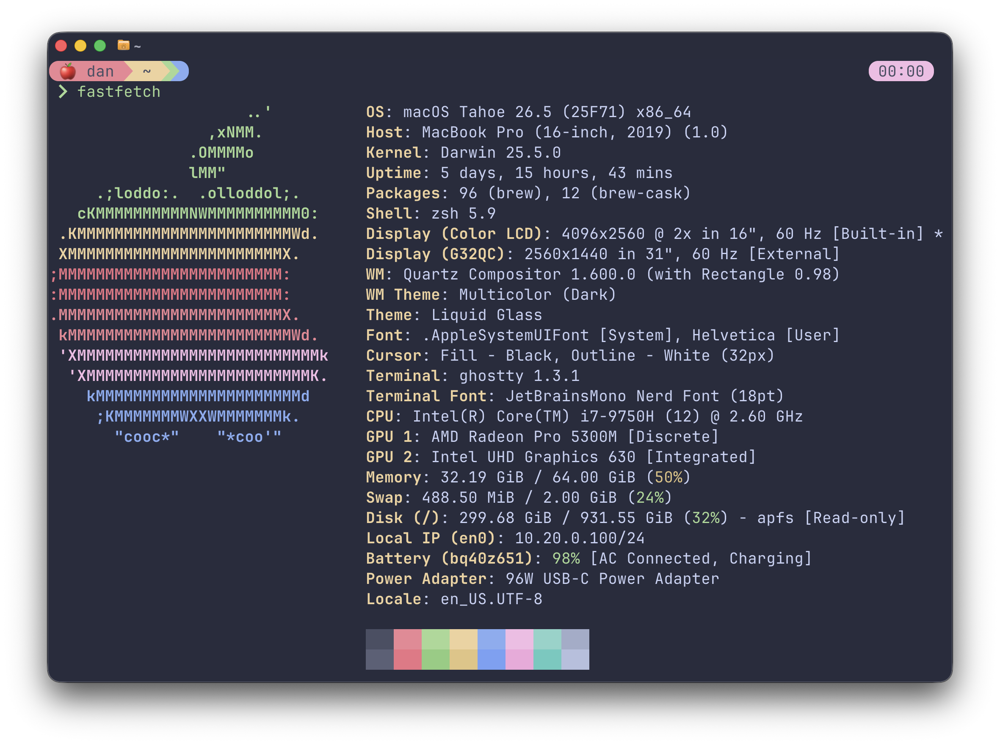

# dotfiles

My dotfiles. Currently managed with [chezmoi](https://chezmoi.io).

## Usage

First time:

```sh
sh -c "$(curl -fsLS https://get.chezmoi.io)" -- init --apply --purge-binary dbeg
```

Then ongoing usage:

```sh
chezmoi cd           # subshell to source dir
chezmoi update       # git pull + re-apply
chezmoi diff         # preview pending changes
chezmoi apply        # apply pending changes
chezmoi add $FILE    # tracks file in chezmoi
chezmoi re-add $FILE # overwrites chezmoi file
```

Note that [chezmoi external sources](https://www.chezmoi.io/user-guide/include-files-from-elsewhere) are used in this project, and refreshed according to configured `refreshPeriod` values.

```sh
chezmoi apply --refresh-externals # refresh externals manually during apply
```

## Overview

| Area | Tools |
|---|---|
| **Dotfiles** | [chezmoi](https://chezmoi.io) |
| **Secrets** | [chezmoi password manager integrations](https://www.chezmoi.io/user-guide/password-managers/) via [Bitwarden](https://bitwarden.com/help/cli) |
| **Terminals** | [Ghostty](https://ghostty.org), [iTerm2](https://iterm2.com) |
| **Packmans** | [Homebrew](https://brew.sh) (formulae/casks defined in [`Brewfile`](home/dot_config/homebrew/Brewfile)), [mise](https://mise.jdx.dev) (generally just runtimes, but exploring using this more as a cross-system package manager... tools defined in [`config.toml`](home/dot_config/mise/config.toml)) |
| **Shell/CLIs** | [zsh](https://www.zsh.org) (and a few plugins), [Starship](https://starship.rs), [atuin](https://atuin.sh), [fzf](https://github.com/junegunn/fzf), and more... |
| **Themes** | [Catppuccin](https://catppuccin.com) Macchiato EVERYWHERE |

Terminal preview:


